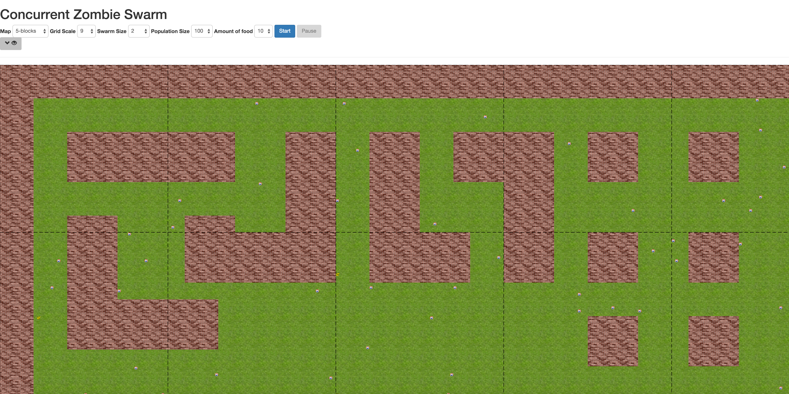
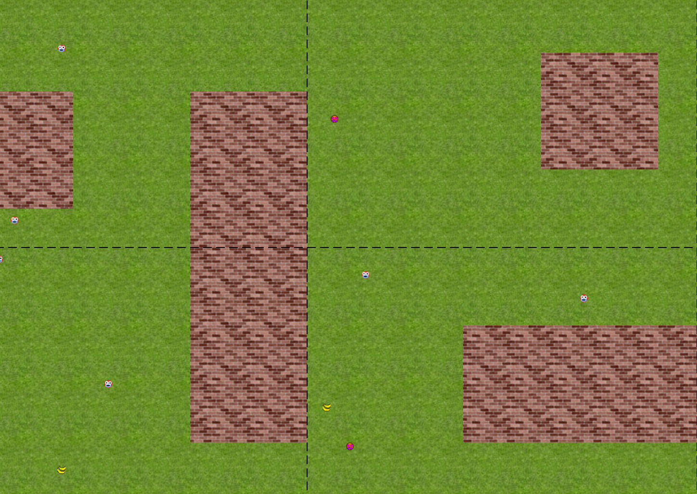

# swarmer
A zombie apocalypse simulation built using Erlang and Javascript

This simulation was developed for the final year project of our Computer Science degree at the University of Kent.

## Setup
To run the application, clone the repo, run setup and then run swarmer.

Open swarmer.html to start the web-side application, and to kick off the swarmer application building an environment in which the simulation will run.

On a Mac, to run the project use the launchswarmer script. This will open swarmer.html for you.

It should work on Windows based systems, though this has as of yet been untested fully.
To setup on Windows, use rebar get-deps, rebar compile, and then run swarmer.bat

## User Interface
The visualisation for the application is built using the D3 Javascript library. Currently, it deals with reports from the Erlang application, and renders them. It is not asynchronous. This is something I would like to work on in future.

This is the currently UI:

### UI Controls
* Map - Select different maps for the simulation.
* Grid scale - Scale the UI, this does not effect the size of the simulation.
* Swarm Size - The amount of zombies to spawn.
* Population Size - The amount of humans to spawn.
* Amount of food - The amount of food to spawn.
* Start - Kick the simulation off.
* Pause - Send a pause message to all entities.

### The Simulation
There are three main types of entities involved in the simulation; zombies, humans and food. Humans eat food, zombies eat humans.

Lighter coloured entities are humans, and the bright pink blobs are zombies.

If you click on one, the JS will draw all of the other blobs that is currently in its sight.

